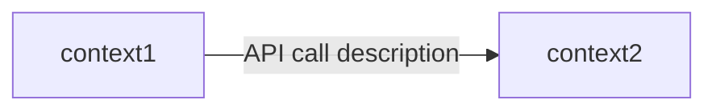
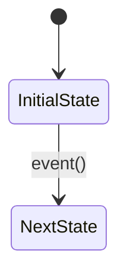
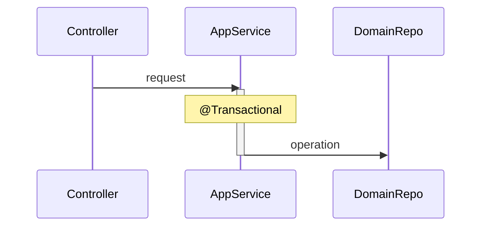

# Handoff 01: Design → API Contract

> This file is written by the Design Architect agent and consumed by the API Contract Author agent.
> All sections must be filled before proceeding to the API contract phase.

## Feature

- **Ticket/Goal**:
- **Author**: Design Architect Agent
- **Date**:

## Scope

- **In scope**:
- **Out of scope (non-goals)**:

## DDD Design Diagrams

### Bounded Context Interaction

### Entity State Transitions

### Main Flow Sequence

## Architecture Decisions

- **Bounded contexts impacted**:
- **New/changed invariants**:
- **Transaction boundaries**:
- **Concurrency strategy**:

## API Changes

### REST Endpoints
| Method | Path | Description |
|--------|------|-------------|

### Module API Changes
| Interface | Method | Description |
|-----------|--------|-------------|

### Database/Flyway
| Migration | Description |
|-----------|-------------|

## Acceptance Criteria

1.
2.
3.

## Failure Cases and Edge Cases

1.
2.
3.

## Known Risks

-

## File-Level Implementation Plan

| File Path | Action | Description |
|-----------|--------|-------------|
| `src/...` | create/modify | ... |

## Implementation Checklist

- [ ] Domain model changes
- [ ] Repository interface changes
- [ ] Module API changes
- [ ] Application service orchestration
- [ ] JPA entity and mapper changes
- [ ] Flyway migration
- [ ] REST controller and DTO changes
- [ ] OpenAPI spec updates
- [ ] Tests to add/update

## Revision History

| Rev | Date | Feedback | Changes Made |
|-----|------|----------|--------------|
