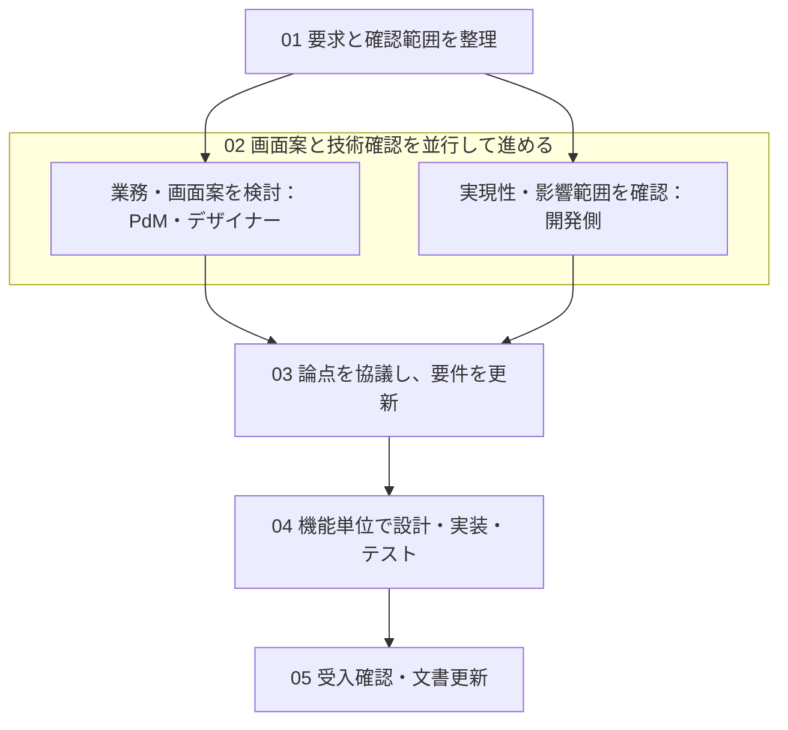

# 既存システムの機能追加 — AIを活用した三者協働の進め方

対象：Java（DDD）のバックエンドAPI ＋ Next.jsのフロントエンド

## 基本方針

PdM・デザイナー・開発側が、要求、画面案、技術的な確認結果を共有し、機能単位で実装可能な要件に具体化する。画面案の検討と実現性・影響範囲の確認は並行して進める。確認の深さや文書量は、変更の影響と不確実性に合わせて調整する。

新規画面でも既存データや業務ルールに依存する場合があり、小さな画面変更でも大きな影響を伴う場合がある。新規・既存の画面数だけで進め方を決めない。

## 総合フロー

説明は新版の総合フロー図の01〜05に対応する。以下は同じ構成を示す簡略図である。

画面案は先に着手できる。確認が必要な前提を共有し、それに依存しない部分は進める。業務・画面の仕様に影響する変更が判明した場合は、関係者で再確認する。図の矢印は主な流れを示しており、全機能を一括で確定する工程の区切りではない。

## 1. 役割と文書の責任

| 役割 | 主な責任 |
| --- | --- |
| PdM | 目的・対象ユーザー・優先順位・範囲・業務ルール・受入条件を決める。 |
| デザイナー | 画面構成・操作導線・各種表示状態を設計し、Figmaを管理する。試作段階から使いやすさを確認する。 |
| 開発側 | 必要な範囲の実現性・既存仕様・影響を確認し、要件整理、技術設計、実装、テストを担う。 |
| AI | 調査、たたき台、会議要約、変更案、コード、テストの作成を補助する。判断と確認は人が行う。 |

### 要件定義書は開発側で取りまとめる

要件定義書全体の作成・更新は、開発側で取りまとめることをおすすめします。既存システムの仕様や制約を踏まえ、新しい要件との整合性を確認しながら整理しやすいためです。PdMとデザイナーは、それぞれ業務要件と画面・操作に関する情報提供・確認を行います。

### 文書の正本と管理担当を決める

| 文書 | 主な管理担当 | 記載内容／確認者 |
| --- | --- | --- |
| 要求定義書 | PdM | 目的・範囲・業務要求・受入目標。関連する担当が確認。 |
| 確認結果・質問一覧 | 開発側 | 実現性、既存仕様、根拠、影響、未確認事項。業務判断が必要な点をPdMに確認。 |
| 要件定義書 / Functional Specification | 機能ごとに指定した主筆 | 利用者から見た振る舞い。PdMが業務、デザイナーが画面動作、開発側が実現可能性を確認。 |
| Figma | デザイナー | 画面・導線・表示状態。必要な前提をPdM・開発側と確認。 |
| 基本設計書 | 開発側 | API・ドメイン・DB・互換性・非機能要件・移行・テスト方針。 |
| 決定ログ | 要件定義書の主筆 | 決定内容、決定者、対象要件、未決事項。該当する決定者が確認。 |

上記は記録すべき情報の区分であり、毎回すべてを独立した文書として作成する必要はない。軽微変更では、チケットとFigmaの注記で足りる場合もある。同じルールを重複記載せず、要件IDとリンクで関連付ける。

## 2. 影響と不確実性に応じた確認の進め方

要件定義書は開発側で取りまとめ、確認の深さと画面検討の順序は、変更の影響と不確実性に応じて調整します。画面案の検討は先に進められますが、未確認の前提に依存する仕様は、確認結果を踏まえて確定します。

| 進め方      | 適用する状況                           | 開発側の確認                             | 画面検討との関係                                          |
| -------- | -------------------------------- | ---------------------------------- | ------------------------------------------------- |
| **簡易確認** | 影響が小さく、関連する仕様や前提が明確な変更           | 変更箇所と影響を短く確認します。通常、独立した調査工程は設けません。 | 明確な前提に基づいて、そのまま進められます。                            |
| **並行確認** | 一部の仕様や実現方法に未確認事項がある変更            | 画面検討と並行して、必要な事項を確認し、結果を順次共有します。    | 未確認事項に依存しない部分を進めます。依存する部分は仮案として扱い、確認後に確定します。      |
| **先行確認** | 実現可否や重要な業務ルールによって、画面・操作が大きく変わる変更 | 画面仕様の判断に必要な事項を優先して確認します。           | その結果に依存する仕様の確定は待ちます。比較用の画面案や、影響を受けない部分の検討は進められます。 |

### 新規画面が中心の場合の判断例

| 変更例 | 主な確認対象 | 想定される進め方 |
| --- | --- | --- |
| 新規の静的説明ページと入口を追加 | ルーティング、ログイン要否、画面規約 | 軽微変更 |
| 確認済みAPIを使う新規一覧画面 | 表示項目、検索条件、ページング、閲覧範囲 | 軽微変更または並行検討 |
| 新規の申請画面 | 保存先、入力検証、重複申請、状態遷移 | 並行検討。重要な論点は重点確認 |
| 既存画面に取消ボタンを追加 | 取消権限、状態、在庫・決済・通知への影響 | 影響に応じて重点確認 |
| 独立した新機能 | 新しい業務・データ設計、認証や共通機能との接続 | 新機能の実現性確認を中心に並行検討 |

## 3. 五段階の進め方

### 01 要求と確認範囲を整理

PdMが、背景と問題、対象ユーザー、主要ユースケース、希望する業務フロー、初期段階の権限案、受入目標、未確定事項、対象外の範囲を整理する。必要に応じて優先順位と成功指標を加える。確定した要求と仮説を区別する。

必要な担当が、設計に影響する不確実な点と確認範囲を整理する。確認には「解決したい質問」「影響する判断」「担当と回答予定」を設定する。既知の情報は再利用し、判断に必要な内容が揃ったら、その論点の調査を終える。

成果物：要求定義書、確認したい論点。

### 02 画面案と技術確認を並行して進める

#### 業務・画面案の検討：PdMとデザイナー

操作導線、画面構成、文言、ワイヤーフレーム、試作を検討する。必要に応じて利用者に試してもらい、目的や使いやすさを確かめる。開発側の確認完了を待たずに着手できる。

未確認のデータや業務ルールに依存する箇所は、仮の前提として明記する。前提に依存しない部分は継続し、その前提が確認できるまでは当該箇所を確定仕様として扱わない。

成果物：画面案、Figma、確認したい業務・操作上の論点。

#### 実現性・影響範囲の確認：開発側とAI

必要な範囲で、データ、API、権限、状態遷移、既存の呼出元、外部連携、バッチ、履歴データなどを確認する。新機能では、新しいデータ設計や共通機能への接続なども検討する。全コードの調査を一律に行う必要はない。

必要なら、この段階で技術案の比較や小さな検証を行う。AIの説明はコード・テスト・実際の動作と照合し、根拠と未確認事項を残す。既存の挙動が今後も正しい業務ルールとは限らない。

PdM向けには「現在の動作 → 要求との差 → 利用者への影響 → 選択肢 → 決めたいこと」に整理する。確認全体が終わる前でも、画面や業務の判断に影響する結論を順次共有する。

成果物：確認結果、質問、選択肢。

### 03 論点を協議し、要件を更新

指定した主筆が、要求、画面案、確認済みの情報をもとに要件のたたき台を用意する。AIを補助に使い、「確定」「提案」「未決」を区別する。画面案はデザイナーが管理する。

業務ルール、権限、状態遷移、例外、境界条件、画面動作など、判断が必要な論点を関係者で協議する。部門や役割をまたぐ重要な判断は関係する担当が確認する。軽微な事項はコメント等で確認でき、毎回三者の会議を開く必要はない。

決定内容をログに残し、主筆が要件定義書を更新する。PdMは業務、デザイナーは画面、開発側は技術的な実現可能性を確認する。Figma・要求定義書・基本設計書への影響は各管理担当が反映する。

要件定義書には、対象範囲、役割と権限、業務フロー、画面遷移、状態遷移、正常・例外・境界条件、入力検証、受入シナリオを必要な範囲で記載する。HTTP仕様やDB項目の詳細は技術設計側にまとめる。

この活動は継続して行う。実装対象の機能単位で、重要な未決事項が解消され、受入条件と仕様の版が明確になった範囲から次へ進む。

成果物：要件定義書、決定ログ、更新されたFigma。

### 04 機能単位で設計・実装・テスト

開発側が、対象機能の合意した要件をもとに詳細を具体化する。API、DDDのドメインルール、DB、トランザクション、並行更新、互換性、移行、非機能要件、テスト方針を必要に応じて設計する。初期の技術検討は02から行え、詳細は実装とともに具体化してよい。

AIには、対象要件、受入条件、関連Figma、基本設計、対象コード、既存テストを渡す。開発側がコードとテスト結果を確認する。

タスクは、例えば「却下された申請を修正して再提出できる」という利用者の行動単位で区切る。その中にドメイン・API・画面・テストの作業を置く。技術的な下準備は別タスクにしてもよい。

業務・画面の仕様に影響する変更が判明した場合は、理由・影響・選択肢を関係者に示して再確認する。業務上の振る舞いに影響しない技術的な詳細は、開発側で判断する。

成果物：必要な基本設計、小さな実装タスク、コード、テストと結果。

### 05 受入確認・文書更新

PdMが業務上の受入条件、デザイナーが画面と操作、開発側が技術的な動作と既存機能への影響を確認する。小さな機能単位で確認し、必要に応じて利用者・運用担当にも確認を依頼する。

画面や操作の確認は02の試作段階から行い、ここでは実装された機能を確認する。最後に、合意した要件・コード・テスト・Figmaを整合させ、各管理担当が関連文書を更新する。

成果物：確認済みの機能、更新済み文書。

## 4. 会議とAIによる文書更新の運用

### 会議音声から、変更箇所を確認できる更新案を作る

音声の文字起こしは有効だが、発言だけでは提案と決定を区別できない場合がある。正式な決定ログを基準に、AIが差分案を作成する。矛盾や曖昧な発言は確認事項として残す。複数回の会議も、会議ごとに最新版へ反映する。

| タイミング | 実施内容 |
| --- | --- |
| 会議前 | 主筆がたたき台・論点・選択肢を共有。各担当は関連箇所を確認。 |
| 会議中 | 議題ごとに結論を確認し、決定・保留・対象外を記録。 |
| 会議後：AI | 最新版の要件、今回の決定ログ、文字起こしから変更案と矛盾一覧を作成。 |
| 会議後：主筆 | 決定ログと照合し、追加・変更・削除の差分を確認して反映。 |
| 担当者確認 | 影響する業務・画面・技術の担当が確認。版と変更理由を記録。 |

### 論点と決定ログの例

以下は説明用の例である。

Q-012：却下された申請を、利用者が修正して再提出できるか。現状は再提出不可。選択肢は「同じ申請を更新」または「新規申請を作成」。履歴と利用者の操作数への影響を比較して決める。

| ID | 結論／状況 | 決定・担当 | 影響 |
| --- | --- | --- | --- |
| D-012 | 同じ申請を修正し、再提出可能とする。 | PdM／確定 | FR-012、申請詳細画面 |
| Q-013 | 旧データにも適用できるかを調査。 | 開発側／未決 | 移行、履歴、API |

### AIへの依頼文の例

「最新版の要件定義書、今回の決定ログ、文字起こしを照合してください。①確認済みの決定、②要件ID別の追加・変更・削除案、③矛盾と未決事項、④Figma・基本設計書への影響を出力してください。決定の根拠を示し、提案や推測を確定事項にしないでください。曖昧な点は質問として残し、正式文書は直接上書きしないでください。」

## 5. 要件と検証をつなぐ例

以下は申請機能を想定した説明用の例である。

| ID | 定義／確認内容 |
| --- | --- |
| FR-012 | 利用者は却下された自分の申請を修正し、再提出できる。 |
| BR-012 | 他人の申請は変更できない。承認済みの申請は再提出できない。 |
| AC-012 | 本人が却下状態の申請を再提出すると申請中になる。履歴が残る。 |
| AC-013 | 他人の申請や承認済みの申請への再提出操作を拒否し、データを変更しない。 |

FRは機能要件、BRは業務ルール、ACは受入条件を表す。チーム内で識別できれば、別の採番方式でもよい。

## 6. 説明時によくある質問

### 新規画面が中心でも、開発側の確認は必要か

データ・権限・業務ルール等に未確認の前提があれば、その部分を確認する。既存コード全体の調査が必要とは限らない。前提が明確な場合は、短い確認で進められる。

### PdMとデザイナーだけで先に画面を作ってよいか

着手してよい。画面の試作と技術確認を並行し、依存する前提を共有する。技術確認の完了まで、すべての画面検討を止める必要はない。

### 要件定義書は必ず開発側が書くのか

機能ごとに主筆を決める。既存仕様との整合が複雑な場合は開発側が担当する。誰が主筆でも、各役割の内容責任は変わらない。

### 毎回、全員の会議や複数の文書が必要か

変更の大きさと論点に応じて調整する。軽微変更はチケットとコメントで確認できる。重要な業務判断や役割間の不整合がある場合に、関係者で協議する。

### 五段階を一括で終えてから実装するのか

機能単位で進める。ある機能を実装しながら、別の機能の画面案や技術確認を進められる。AIを使う場合も、重要な未決事項を解消した範囲を明確にして実装する。
