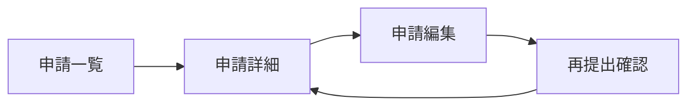

# 機能追加における成果物サンプル

## このサンプルの前提

既存システムに「却下された申請を、申請者が修正して再提出できる機能」を追加する例です。

- バックエンド：Java（DDD）
- フロントエンド：Next.js
- 既存機能：申請一覧、申請詳細、申請の承認・却下
- 新機能：却下された申請の修正・再提出

文書の役割は次のように分けます。

| 文書 | 主な内容 |
| --- | --- |
| 要求定義書 | なぜ作るのか、誰のためか、業務上何を実現するのか |
| 確認したい論点 | まだ決まっていない業務上・技術上の質問 |
| 画面案・Figma | 画面構成、操作導線、利用者体験の案 |
| 技術確認結果 | 既存システムの事実、影響範囲、実現方法の選択肢 |
| 要件定義書（Functional Specification） | 合意した利用者向けの振る舞い、業務ルール、受入条件 |
| 画面基本設計書 | 各画面の項目、表示条件、操作、画面状態の詳細 |
| API基本設計書 | APIのパス、入出力、権限、エラー、冪等性などの詳細 |

---

## 01 要求と確認範囲を整理

### 01-1 要求定義書（PdMが作成）

```markdown
# 要求定義書：却下申請の再提出

## 1. 背景と課題

現在、申請が却下された場合、申請者は内容を修正して再提出できない。
申請者は同じ内容を新規申請として入力し直す必要があり、入力負担が大きい。

## 2. 目的

却下理由を確認した申請者が、必要な箇所を修正して再提出できるようにする。
入力のやり直しを減らし、申請処理を円滑にする。

## 3. 対象ユーザー

| ユーザー | 利用目的 |
| --- | --- |
| 申請者 | 自分の却下申請を修正して再提出する |
| 承認者 | 再提出された申請を確認する |
| 管理者 | 申請履歴と状態を確認する |

## 4. 主要ユースケース

1. 申請者が申請一覧から却下された申請を選択する。
2. 申請詳細画面で却下理由を確認する。
3. 申請者が申請内容を修正する。
4. 修正した申請を再提出する。
5. 再提出後、申請状態が「申請中」になる。

## 5. 初期の業務ルール案

- 再提出できるのは、申請者本人の「却下」状態の申請だけとする。
- 「承認済み」「取消済み」の申請は再提出できない。
- 再提出後も、元の申請IDと却下履歴を保持する。
- 再提出された申請は、通常の承認フローに戻す。

## 6. 受入目標

- 申請者が、却下理由を確認して内容を修正できる。
- 修正後の申請を再提出できる。
- 再提出後に申請状態と履歴が正しく更新される。
- 他人の申請や、再提出できない状態の申請を変更できない。

## 7. 未確定事項

- 再提出時に、すべての項目を編集可能にするか。
- 再提出回数に上限を設けるか。
- 再提出時に承認者へ通知するか。
- 既存の却下申請データをすべて再提出対象にするか。

## 8. 対象外

- 承認フロー自体の変更
- 却下理由の入力方法の変更
- 通知機能全体の刷新
```

### 01-2 確認したい論点（初期版）

```markdown
# 確認したい論点：却下申請の再提出

| ID | 論点 | 確認したいこと | 判断に影響する事項 | 担当 | 期限 | 状態 |
| --- | --- | --- | --- | --- | --- | --- |
| Q-001 | 編集範囲 | 再提出時に編集できる項目はどれか | 画面項目、API、入力検証 | PdM・デザイナー | 2026-09-15 | 未確認 |
| Q-002 | 状態遷移 | 「却下」から「申請中」へ直接遷移できるか | Domainの状態遷移、履歴 | PdM・開発側 | 2026-09-15 | 未確認 |
| Q-003 | 再提出回数 | 再提出回数の上限が必要か | DB項目、画面表示、業務ルール | PdM | 2026-09-15 | 未確認 |
| Q-004 | 通知 | 再提出時に承認者へ通知するか | 通知サービス、運用 | PdM・開発側 | 2026-09-16 | 未確認 |
| Q-005 | 既存データ | 過去の却下申請も対象にするか | データ状態、移行、互換性 | PdM・開発側 | 2026-09-16 | 未確認 |

## 進め方

- Q-001はPdMとデザイナーが画面案を比較して検討する。
- Q-002とQ-005は開発側が既存コード・DB・テストを確認する。
- Q-003とQ-004は業務上の必要性をPdMが判断し、開発側が影響を確認する。
```

这个阶段不要求决定全部细节。重点是把“还需要决定什么”明确化。

---

## 02 画面案と技術確認を並行して進める

### 02-1 画面案・Figmaへの整理例

PdM与设计师可以先做画面案。未确认的业务规则需要标记为假设，不应直接当作最终规格。

```markdown
# 画面案：却下申請の再提出

## 1. 画面一覧

| 画面ID | 画面名 | 変更 | 目的 | Figma |
| --- | --- | --- | --- | --- |
| SCR-001 | 申請一覧 | 既存画面にボタン追加 | 却下申請を見つける | [Figma Frame](https://figma.example.com/file/abc?node-id=1) |
| SCR-002 | 申請詳細 | 既存画面を拡張 | 却下理由と内容を確認する | [Figma Frame](https://figma.example.com/file/abc?node-id=2) |
| SCR-003 | 申請編集 | 新規画面 | 却下内容を修正する | [Figma Frame](https://figma.example.com/file/abc?node-id=3) |
| SCR-004 | 再提出確認 | 新規ダイアログ | 再提出前に確認する | [Figma Frame](https://figma.example.com/file/abc?node-id=4) |

## 2. 画面遷移案

申請一覧（SCR-001）
  → 却下された申請を選択
申請詳細（SCR-002）
  → 「修正して再提出」を押下
申請編集（SCR-003）
  → 「再提出」を押下
再提出確認（SCR-004）
  → 「再提出する」を押下
申請詳細（SCR-002）へ戻り、状態を表示

## 3. 画面案で確認したいこと

| ID | 仮の画面案 | 確認したいこと | 状態 |
| --- | --- | --- | --- |
| UI-Q-001 | 却下申請の詳細画面に「修正して再提出」を表示 | 再提出可能な状態だけ表示するか | 未確認 |
| UI-Q-002 | 申請編集画面では一部項目を編集不可にする | 申請者が編集できる項目の範囲 | 未確認 |
| UI-Q-003 | 再提出確認ダイアログを表示する | 確認文言と表示項目 | 未確認 |

## 4. Figma上の注記

- `SCR-002 / node-id=2`：再提出可能な状態を仮に「却下」としている。
- `SCR-003 / node-id=3`：編集不可項目は仮置き。Q-001の回答後に確定する。
- `SCR-004 / node-id=4`：再提出後に状態が「申請中」になる想定。
```

### 02-2 開発側の技術確認結果・質問・選択肢

```markdown
# 技術確認結果：却下申請の再提出

## 1. 調査範囲

- `Application` Aggregateの状態定義と状態遷移
- 申請詳細取得APIと申請更新API
- 申請者本人の権限チェック
- 申請履歴の保存方法
- 既存の承認・却下処理と関連テスト

## 2. 確認できた既存仕様

| ID | 確認結果 | 根拠 |
| --- | --- | --- |
| FACT-001 | 申請状態に `REJECTED` が存在する | `ApplicationStatus.java` |
| FACT-002 | 現在の更新APIは `DRAFT` 状態だけを更新対象にする | `UpdateApplicationService.java`、既存テスト |
| FACT-003 | 申請者本人かどうかをApplication層で確認している | `ApplicationPermission.java` |
| FACT-004 | 承認・却下の履歴を`application_history`に保存している | DB定義、`ApplicationHistory` |

## 3. 要求とのギャップ

| ID | 現状 | 要求 | 影響 |
| --- | --- | --- | --- |
| GAP-001 | `REJECTED` は更新できない | 却下後に修正して再提出したい | Domain、更新API、画面 |
| GAP-002 | 編集項目の制限はDRAFT専用 | 却下時の編集項目を定義する必要がある | 入力検証、画面 |

## 4. 選択肢

| ID | 方式 | 長所 | 注意点 | 推奨 |
| --- | --- | --- | --- | --- |
| OPT-001 | 既存の更新処理に`REJECTED`を追加 | 変更範囲が小さい | 再提出と通常編集の条件を分ける必要がある | 採用候補 |
| OPT-002 | 再提出専用APIを追加 | 権限・状態・履歴を明確に分けられる | APIとテストが増える | 採用候補 |
| OPT-003 | 新しい申請を作成して履歴で関連付ける | 既存状態遷移を変更しない | 申請ID、履歴、画面表示が複雑になる | 非推奨 |

## 5. PdMに確認したい質問

| ID | 質問 | 判断が必要な理由 | 関連画面 |
| --- | --- | --- | --- |
| DEV-Q-001 | 却下申請を同じ申請IDで再提出するか、新しい申請として作成するか | 履歴と利用者の見え方が変わる | SCR-002、SCR-003 |
| DEV-Q-002 | どの項目を再提出時に編集可能にするか | Domainと入力検証を決める必要がある | SCR-003 |
| DEV-Q-003 | 再提出時に承認者へ通知するか | 通知機能への影響を確認する必要がある | SCR-004 |
```

02の成果物は、すべてのコードを説明する資料ではありません。画面案や業務判断に影響する事実・質問・選択肢に絞ります。

---

## 03 論点を協議し、要件を更新

以下は、02の結果をPdM・デザイナー・開発側で確認した後の要件定義書の例です。画面の各項目やAPIの細かいJSON定義は、ここではなく基本設計書に記載します。

```markdown
# 要件定義書：却下申請の再提出

## 0. 文書情報

| 項目 | 内容 |
| --- | --- |
| 文書ID | REQ-APPLICATION-RE-SUBMIT |
| 版 | v1.0 |
| 状態 | 合意済み |
| 取りまとめ | 開発側 |
| PdM確認 | 完了 |
| デザイナー確認 | 完了 |
| 開発側確認 | 完了 |
| 関連Figma | [申請再提出フロー](https://figma.example.com/file/abc) |
| 関連基本設計 | [画面基本設計](./04-画面基本設計.md)、[API基本設計](./04-API基本設計.md) |

## 1. 対象範囲

### 対象

- 却下された申請の内容を修正する。
- 修正した申請を再提出する。
- 再提出後に申請状態を「申請中」に戻す。
- 元の却下履歴を保持する。

### 対象外

- 承認フローのルール変更
- 却下理由の入力方法の変更
- 通知機能の全面的な見直し

## 2. アクターと権限

| アクター | できること |
| --- | --- |
| 申請者本人 | 自分の却下申請を修正し、再提出できる |
| 他の一般ユーザー | 申請内容を変更できない |
| 承認者 | 再提出された申請を通常の承認フローで確認できる |
| 管理者 | 申請内容と履歴を確認できる |

## 3. 業務フロー

1. 申請者が自分の却下申請を開く。
2. 申請者が却下理由を確認する。
3. 申請者が編集可能な項目を修正する。
4. 申請者が再提出を実行する。
5. システムが申請内容を保存し、状態を「申請中」に変更する。
6. システムが再提出の履歴を保存する。

## 4. 状態遷移

| 現在の状態 | 操作者 | 操作 | 次の状態 | 条件 |
| --- | --- | --- | --- | --- |
| 却下 | 申請者本人 | 修正して再提出 | 申請中 | 必須項目が有効 |
| 却下 | 他のユーザー | 修正して再提出 | 変更なし | 権限なし |
| 承認済み | 申請者本人 | 修正して再提出 | 変更なし | 操作不可 |
| 取消済み | 申請者本人 | 修正して再提出 | 変更なし | 操作不可 |

## 5. 機能要件

| ID | 要件 |
| --- | --- |
| FR-001 | 申請者本人は、自分の却下申請を編集画面で開ける。 |
| FR-002 | 申請者本人は、定義された編集可能項目を修正できる。 |
| FR-003 | 必須項目が有効な場合、申請者は再提出できる。 |
| FR-004 | 再提出後、申請状態は「申請中」になる。 |
| FR-005 | 再提出時、元の却下履歴を保持する。 |

## 6. 業務ルール

| ID | ルール |
| --- | --- |
| BR-001 | 再提出できるのは、申請者本人の「却下」状態の申請だけである。 |
| BR-002 | 「承認済み」「取消済み」の申請は再提出できない。 |
| BR-003 | 他人の申請は、URLを直接指定しても変更できない。 |
| BR-004 | 再提出に成功した場合、申請履歴を追加する。 |

## 7. 画面上の主要な振る舞い

| ID | 振る舞い |
| --- | --- |
| UI-001 | 却下状態かつ本人の申請の場合、「修正して再提出」を表示する。 |
| UI-002 | 再提出できない状態の場合、再提出操作を表示しないか、操作不可として理由を示す。 |
| UI-003 | 再提出前に確認を行う。 |
| UI-004 | 再提出成功後、状態と履歴を更新して表示する。 |
| UI-005 | 詳細な画面項目と表示文言はFigmaおよび画面基本設計書に従う。 |

## 8. 例外・境界条件

| ID | 条件 | 期待する結果 |
| --- | --- | --- |
| EX-001 | 必須項目が未入力 | 再提出せず、項目ごとにエラーを表示する |
| EX-002 | 画面表示後に別ユーザーが状態を変更 | 再提出を拒否し、最新状態の再取得を促す |
| EX-003 | 同じ操作を二重送信 | 1回だけ処理し、重複履歴を作らない |
| EX-004 | APIが一時的に失敗 | 入力内容を保持し、再試行できる |

## 9. 受入条件

### AC-001：本人が再提出できる

```gherkin
Given 申請者本人が「却下」状態の申請を開いている
And 必須項目が有効である
When 「修正して再提出」を実行する
Then 申請状態が「申請中」になる
And 再提出履歴が保存される
```

### AC-002：他人の申請を変更できない

```gherkin
Given 他人の「却下」状態の申請を指定している
When 再提出APIを実行する
Then 権限エラーになる
And 申請内容と状態は変更されない
```

## 10. 決定ログ

| ID | 決定 | 決定者 | 影響 |
| --- | --- | --- | --- |
| D-001 | 同じ申請IDで再提出する | PdM | Domain、API、履歴、画面 |
| D-002 | 再提出時は一部項目を編集不可にする | PdM・デザイナー | 画面基本設計、入力検証 |
| D-003 | 通知は今回の対象外とする | PdM | API、通知連携 |
```

---

## 04 機能単位で設計

## 04-1 画面基本設計書

```markdown
# 画面基本設計書：申請再提出

## 0. 文書情報

| 項目 | 内容 |
| --- | --- |
| 文書ID | DESIGN-SCREEN-APPLICATION-RE-SUBMIT |
| 対象要件 | FR-001〜FR-005、UI-001〜UI-005 |
| Figma | [申請再提出フロー](https://figma.example.com/file/abc) |

## 1. 画面一覧

| 画面ID | 画面名 | 種別 | Figma Frame |
| --- | --- | --- | --- |
| SCR-001 | 申請一覧 | 既存画面の拡張 | `申請一覧 / Desktop` |
| SCR-002 | 申請詳細 | 既存画面の拡張 | `申請詳細 / 却下` |
| SCR-003 | 申請編集 | 新規画面 | `申請編集 / 却下申請` |
| DLG-001 | 再提出確認 | 新規ダイアログ | `再提出確認` |

## 2. SCR-002 申請詳細画面

### 表示条件

| 項目 | 条件 | 表示・操作 |
| --- | --- | --- |
| 修正して再提出 | 状態が却下、ログインユーザーが申請者本人 | 表示・活性 |
| 修正して再提出 | 状態が承認済み、取消済み、または本人以外 | 非表示または非活性。表示する場合は理由を示す |
| 却下理由 | 状態が却下 | 表示 |

### 操作

| 操作ID | 操作 | 処理 |
| --- | --- | --- |
| ACT-001 | 「修正して再提出」押下 | `SCR-003`へ遷移 |
| ACT-002 | 戻る押下 | `SCR-001`へ戻る |

## 3. SCR-003 申請編集画面

### 項目

| 項目ID | 項目名 | 編集可否 | 入力チェック |
| --- | --- | --- | --- |
| F-001 | 申請タイトル | 可 | 必須、100文字以内 |
| F-002 | 申請内容 | 可 | 必須、5000文字以内 |
| F-003 | 申請者 | 不可 | 表示のみ |
| F-004 | 申請番号 | 不可 | 表示のみ |

### 状態

| 状態 | 表示 |
| --- | --- |
| 初期表示 | 既存値を表示 |
| 入力エラー | 項目の近くにエラーを表示 |
| 再提出処理中 | 再提出ボタンを非活性にし、処理中表示を出す |
| APIエラー | エラー文言を表示し、入力内容は保持する |

## 4. DLG-001 再提出確認ダイアログ

- 表示文言：`この内容で再提出しますか？`
- 「キャンセル」押下：ダイアログを閉じる。
- 「再提出する」押下：API-001を呼び出す。
- 成功時：ダイアログを閉じ、申請詳細画面に戻る。
- 競合時：最新状態を取得し、再提出できない理由を表示する。

## 5. 画面遷移


```

## 04-2 API基本設計書

```markdown
# API基本設計書：申請再提出

## 0. 文書情報

| 項目 | 内容 |
| --- | --- |
| 文書ID | DESIGN-API-APPLICATION-RE-SUBMIT |
| 対象要件 | FR-003〜FR-005、BR-001〜BR-004 |
| 対象画面 | SCR-003、DLG-001 |

## 1. API一覧

| API ID | Method | Path | 用途 |
| --- | --- | --- | --- |
| API-001 | POST | `/api/applications/{applicationId}/resubmit` | 却下申請を再提出する |
| API-002 | GET | `/api/applications/{applicationId}` | 申請詳細を取得する |

## 2. API-001 再提出

### リクエスト

```http
POST /api/applications/{applicationId}/resubmit
Authorization: Bearer <token>
Content-Type: application/json
```

```json
{
  "title": "修正後の申請タイトル",
  "content": "修正後の申請内容",
  "version": 3
}
```

### 処理条件

1. 認証ユーザーを取得する。
2. 申請を取得する。
3. 申請者本人であることを確認する。
4. 現在の状態が`REJECTED`であることを確認する。
5. 楽観ロック用の`version`を確認する。
6. 編集可能項目を検証する。
7. 申請内容を更新し、状態を`SUBMITTED`に変更する。
8. 再提出履歴を保存する。

### レスポンス

#### 成功：200 OK

```json
{
  "applicationId": "APP-001",
  "status": "SUBMITTED",
  "version": 4,
  "resubmittedAt": "2026-09-15T10:00:00Z"
}
```

### エラー

| HTTP | Code | 条件 | クライアントの表示・処理 |
| --- | --- | --- | --- |
| 401 | `UNAUTHORIZED` | 未ログイン | ログイン画面へ誘導 |
| 403 | `FORBIDDEN` | 申請者本人ではない | 権限エラーを表示 |
| 404 | `NOT_FOUND` | 申請が存在しない | 詳細画面を表示しない |
| 409 | `INVALID_STATE` | 却下以外の状態 | 最新状態を再取得 |
| 409 | `VERSION_CONFLICT` | 他の更新が先に行われた | 最新内容を再取得して確認を促す |
| 422 | `VALIDATION_ERROR` | 入力値が不正 | 項目ごとのエラーを表示 |

## 3. トランザクションと冪等性

- 申請内容の更新、状態変更、履歴保存は同一トランザクションで処理する。
- `version`が一致しない場合は更新しない。
- 同一の再提出要求が再送された場合、重複履歴を作成しない。

## 4. DDD上の責務

- Application層：認証ユーザー、権限、トランザクションを制御する。
- Domain層：`REJECTED`から`SUBMITTED`への状態遷移と編集可能項目を検証する。
- Repository：申請と履歴を永続化する。

## 5. テスト観点

- 本人かつ却下状態の場合に成功する。
- 他人の申請は403になる。
- 承認済み、取消済みの申請は409になる。
- 入力エラー時にDBが更新されない。
- 同時更新時に409になり、履歴が重複しない。
```

---

## 文書の粒度を判断する目安

要件定義書には、業務上の意味、権限、重要な状態、主要な振る舞い、例外、受入条件を記載します。画面の全項目、具体的な表示文言、APIのJSON、HTTPエラー、トランザクション、DDDのクラス責務は、画面基本設計書・API基本設計書に記載します。

開発側が要件定義書を取りまとめる場合も、PdMが決める業務ルール、デザイナーが決める画面・操作、開発側が決める技術方式を混同しません。AIは各成果物の初稿、差分、質問、テスト案を作成できますが、決定ログの内容と最終版は人が確認します。
